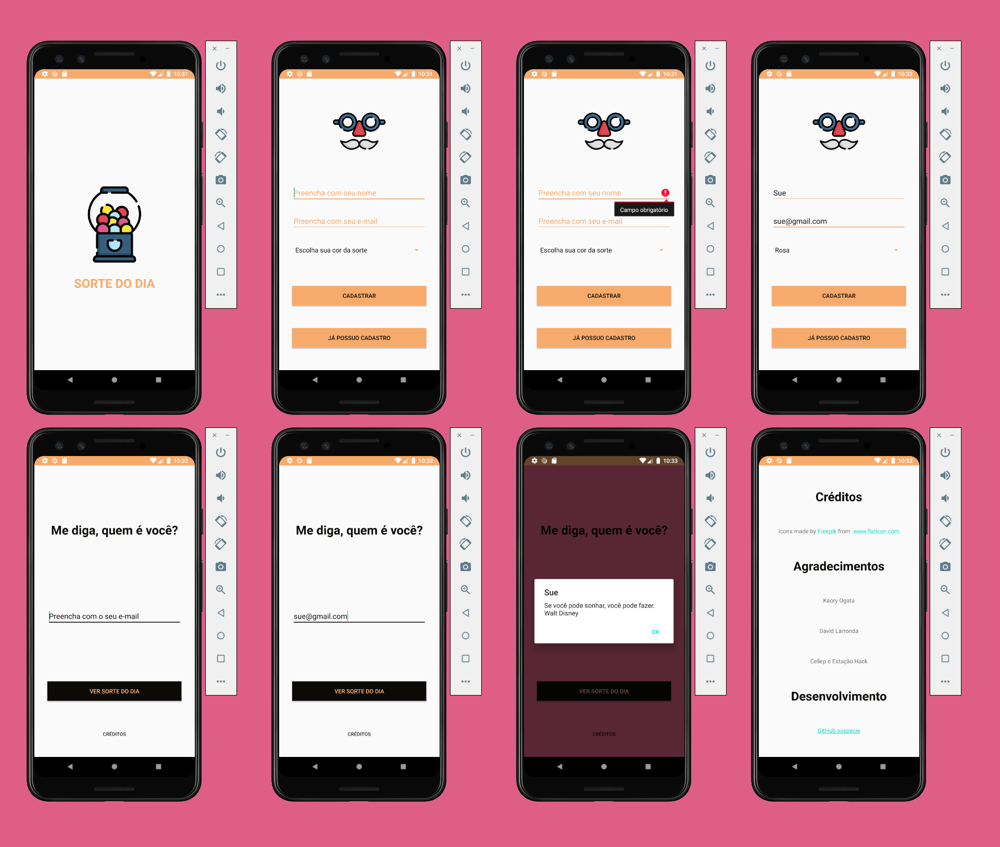

# SORTE DO DIA

Projeto Final do curso Desenvolvimento de Aplicativos Android Studio (Kotlin) - Cellep e Estação Hack

# SOBRE O DESAFIO

Escolher uma das opções abaixo, caso queiram façam mais de uma!
Façam as telas da maneira que quiserem seguindo as instruções do mínimo pedido para cada projeto!
Se ficar complicado, simplifiquem, o projeto é de vocês

> Eu decidi escolher meslar as opções "Buscador de Preferências" e "Biscoito da Sorte" em um único App.
> Nomeado Sorte do Dia, o App permite o usuário realizar um cadastro e escolher sua cor preferida dentre as opções mostradas.
> Após o cadastro, o usuário pode ver uma frase motivacional junto com a cor escolhida. 

## DESCRIÇÃO DO DESAFIO

### Buscador de Preferências 

O app consiste em um cadastro de usuários que grave suas preferências de cor de fundo
- É necessário conter minimamente tela de Splash, Cadastro e Main
- No cadastro, o usuário precisa digitar seu e-mail, seu nome e sua preferência de cor (pode ser através de um spinner, uma entrada de texto, ou Radio Button)
- Deve conter no mínimo 3 cadastros diferentes
- Após os cadastros, na Main, deve-se perguntar algum dado do usuário (seja nome ou e-mail) e modificar a cor de fundo de sua preferência assim que clicar no botão.
- É necessário também que construam Alertas e/ou Toasts em alguma parte de sua aplicação 

### Biscoito da Sorte

Este App consiste em um botão o qual o usuário clica e retorna na tela como resultado, alguma mensagem de sorte e/ou de apoio.
- Necessário minimamente duas telas
- É necessário também que construam Alertas e/ou Toasts em alguma parte de sua aplicação 
- Ao clicar no botão,  a frase motivacional deve ser apresentado ao usuário de forma randômica
- Deve se ter no mínimo 5 frases motivacionais

PS: O foco do app pode ser escolhido por vocês, pode ser um app motivacional, de auto estima, para foco nos estudos, pode ser engraçado com memes, etc...

# RESULTADO 

* [Vídeo do emulador](https://vimeo.com/439640596)
* [APK para Instalação](assets/app-debug.apk)
* [Link na play store em breve]

